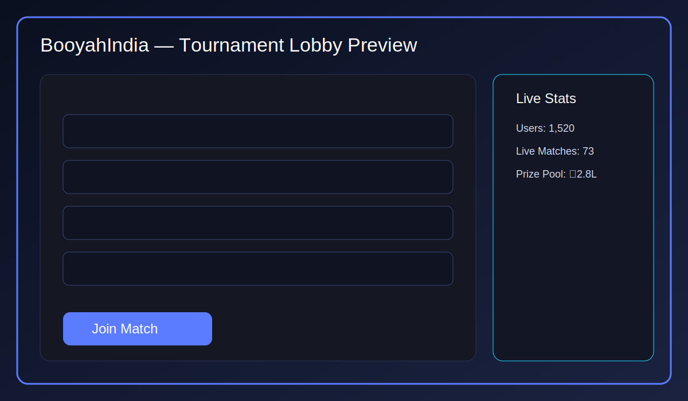
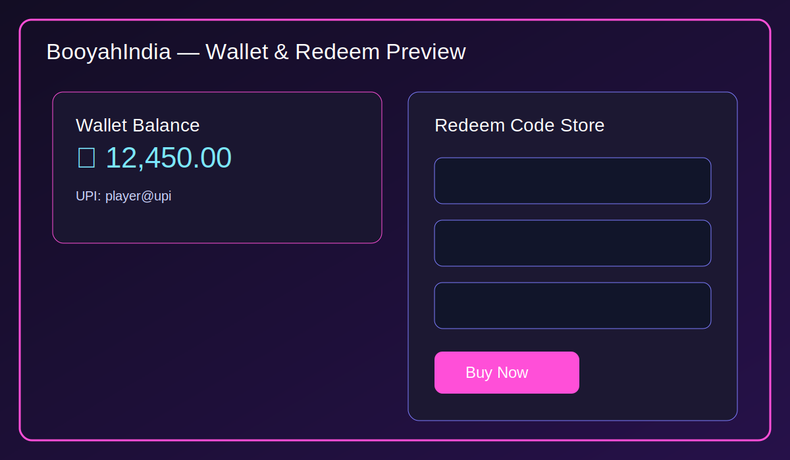
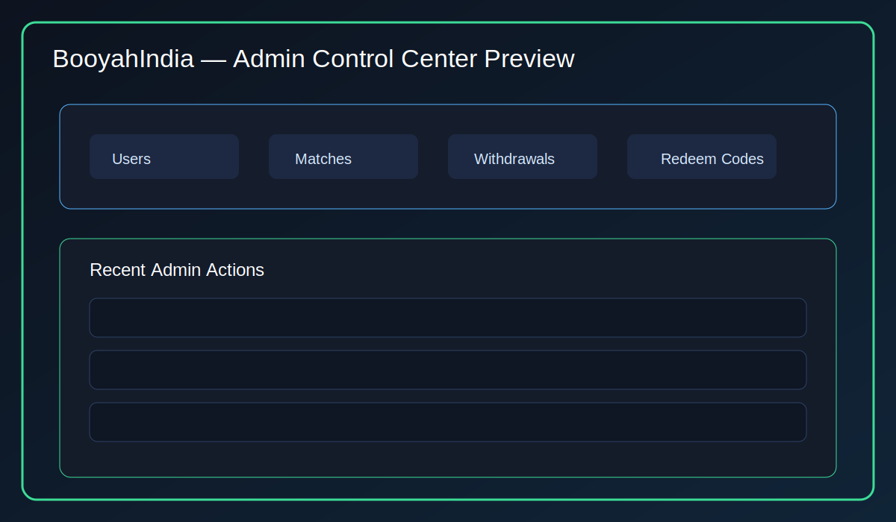

# BooyahIndia (Core PHP MVC)

BooyahIndia is a premium esports tournament platform built for **Ubuntu 22.04 + PHP 8.1 + MySQL 8** with a dark gaming UI optimized for mobile, tablet, and desktop.

## What is implemented now

- Responsive dark UI with premium style + **Sneak Peeks** section on homepage.
- Authentication foundation:
  - Google OAuth route placeholders.
  - Mobile OTP send/verify with expiry checks.
  - Session-based login/logout helpers.
- Tournament module:
  - Upcoming tournament listing from MySQL.
  - Join flow with slot + join-lock constraints.
  - Room credential API visible only to joined users and only at **T-4 minutes**.
- Wallet module:
  - User wallet/UPI read from DB.
  - UPI validation and update endpoint.
- Redeem code system:
  - Purchase from wallet balance.
  - One-time code reveal endpoint.
- Leaderboard page using SQL view.
- Admin controls:
  - Protected admin dashboard.
  - Role switching endpoint (User ↔ Admin) with self-protection and audit logs.
- Security-first backend conventions:
  - Session auth, secure cookies, prepared SQL queries, env-based secrets.

## Project Structure

```text
app/
  Controllers/
  Core/
  Models/
  Services/
  Views/
assets/
  css/app.css
  js/app.js
database/schema.sql
public/index.php
routes/web.php
```

## Quick Start (Ubuntu 22.04)

1. Install stack:
   - `sudo apt update && sudo apt install -y php php-mysql php-mbstring php-xml composer mysql-server nginx`
2. Configure app:
   - `cp .env.example .env`
   - Fill DB + API keys in `.env`.
3. Install dependencies:
   - `composer install`
4. Import schema:
   - `mysql -u root -p < database/schema.sql`
5. Serve app:
   - `php -S 0.0.0.0:8000 -t public`


## Sneak Peek Images





## Production hardening checklist

- Replace OTP debug return with SMS provider delivery.
- Wire Google callback with token verification.
- Add CSRF tokens on all POST endpoints.
- Encrypt room credentials at rest.
- Add Razorpay order + webhook signature verification for deposit automation.
- Add withdrawal queue/approvals with notification workflows.
